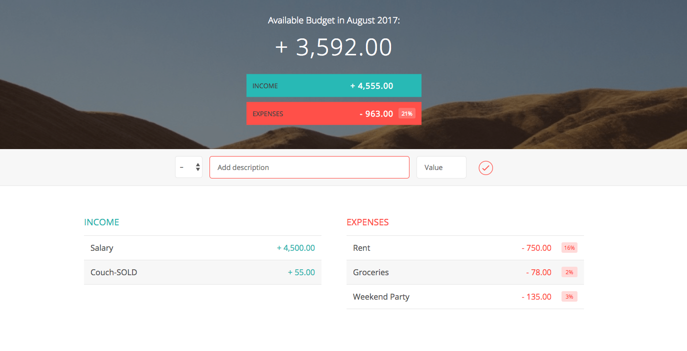

# budgety

# README #

### What is this repository for? ###

* Quick summary: Budgety is a online web application to categorize monthly expenses. 
* HTML5, CSS3, JavaScript, DOM Manipulation

### Who do I talk to? ###

* Repo owner or admin Shreyam Duttagupta
* Other community or team contact: None
* Credits: Jonas schmedtmann
